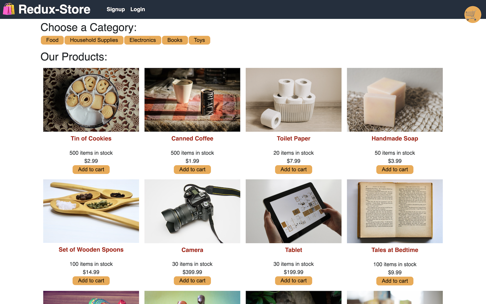
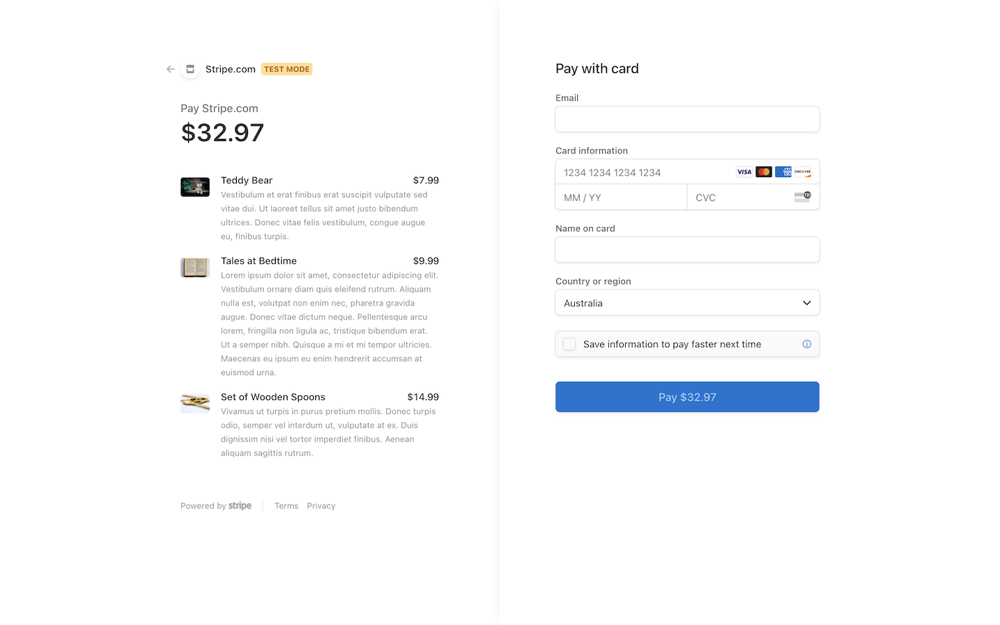
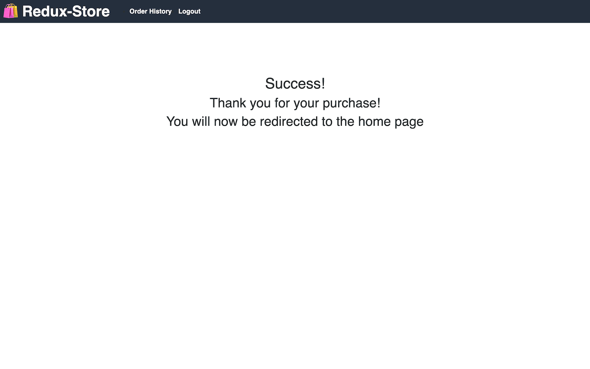
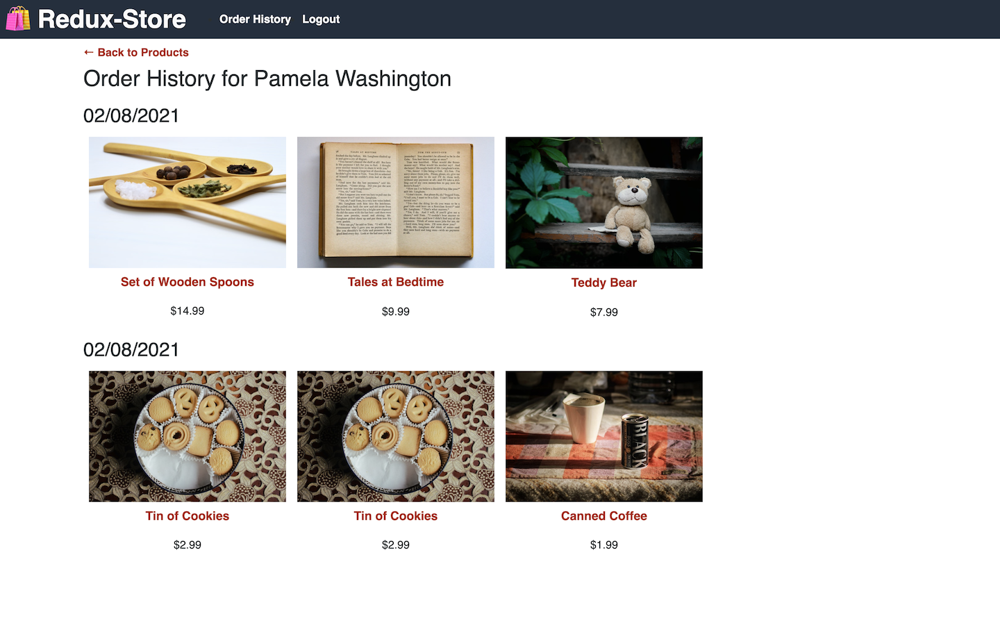

# ReduxStore

Refactoring an app from Context API to Redux

## Deployment

ReactStore has been deployed on Heroku [https://sl-reactstore.herokuapp.com/](https://sl-reactstore.herokuapp.com/)

## Technologies

- Mongoose (MongoDB & Mongo Atlas)
- Express
- React
- Redux
- Node.js
- GraphQL (Apollo Express Server & Client)
- JSON Web Token

## Description

ReactStore is a full-stack e-commerce site with JSON Web Token Authentication & a Stripe checkout, allowing users to purchase various items.

## What We Did

We were provided with a working (front and back-end) site built with React's Context API. This was refactored to utilise Redux's Global State Management.

